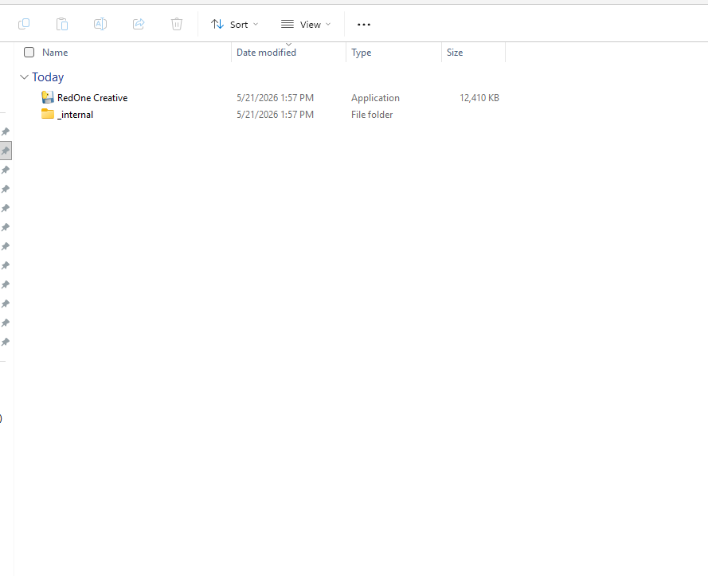
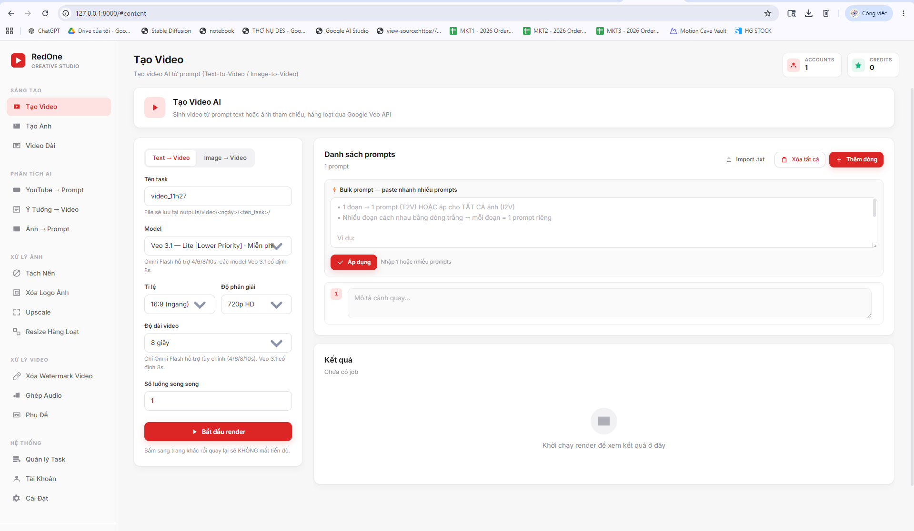
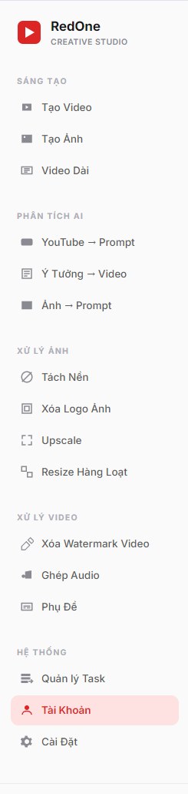
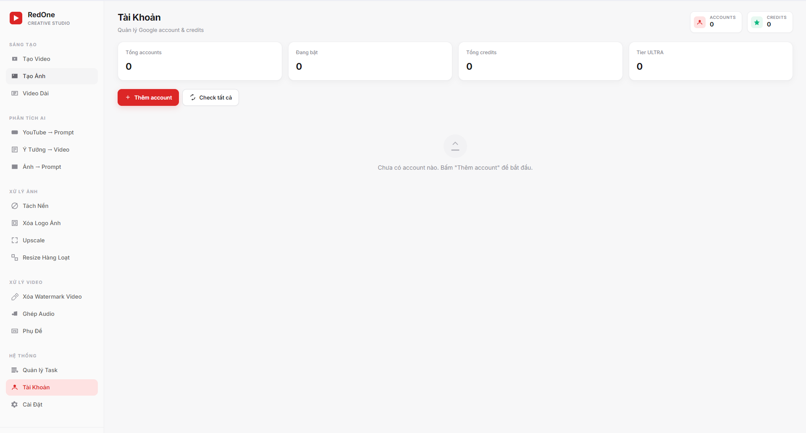
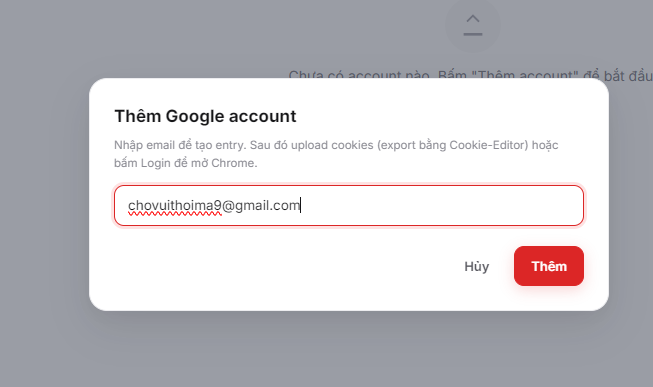
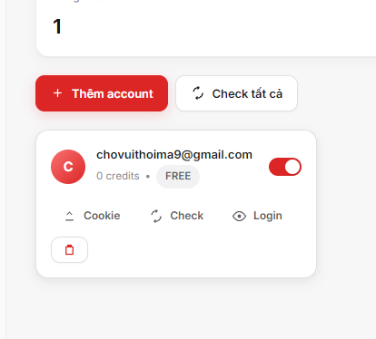
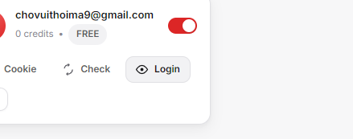
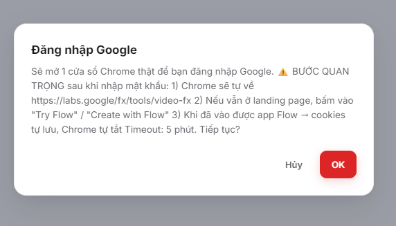
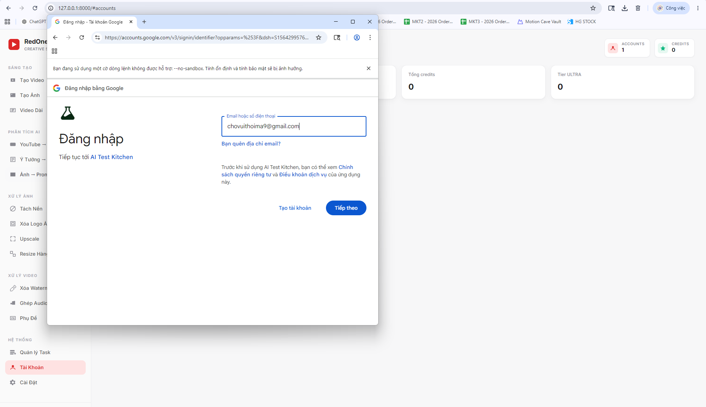
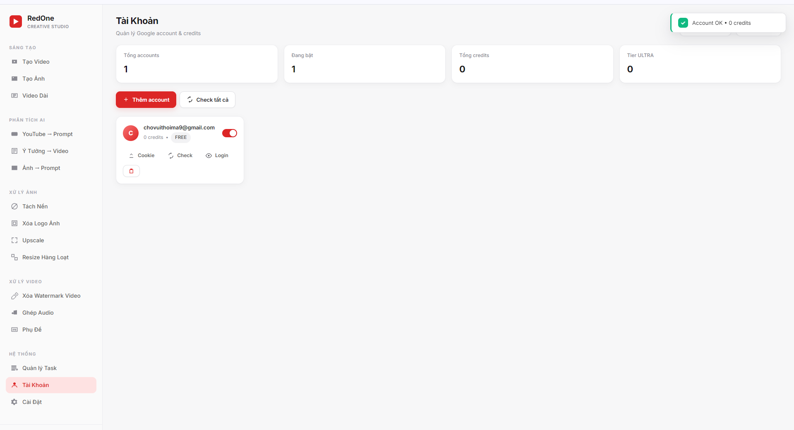

# 📘 RedOne Creative — Hướng dẫn sử dụng đầy đủ

> Tool tạo ảnh và video AI sử dụng credit miễn phí từ Google Labs Flow
> (Veo 3.1 cho video, Nano Banana / Imagen 4 cho ảnh).
>
> **Phiên bản:** v1.0.3 · **Hệ điều hành:** Windows 10/11

---

## 📑 Mục lục

1. [Cài đặt tool](#1-cài-đặt-tool)
2. [Thêm tài khoản Google](#2-thêm-tài-khoản-google)
3. [Đăng nhập Google](#3-đăng-nhập-google)
4. [Tạo ảnh AI](#4-tạo-ảnh-ai)
5. [Tạo video Text-to-Video](#5-tạo-video-text-to-video-t2v)
6. [Tạo video Image-to-Video](#6-tạo-video-image-to-video-i2v)
7. [Quản lý task + tải file về](#7-quản-lý-task--tải-file-về)
8. [Cài đặt thường dùng](#8-cài-đặt-thường-dùng)
9. [Xử lý lỗi thường gặp](#9-xử-lý-lỗi-thường-gặp)

---

## 1. Cài đặt tool

### Yêu cầu
- Windows 10 hoặc 11
- Google Chrome đã cài đặt (https://google.com/chrome)
- Kết nối internet ổn định
- Tài khoản Google có quyền truy cập Google Labs Flow

### Tải về và chạy

1. Vào https://github.com/kiennt-bit/RedOne-Creative-tool/releases
2. Tải file `RedOne-Creative-vX.X.X-win64.zip` (mục **Latest release**)
3. **Chuột phải** vào file zip → chọn **Extract All...** (BẮT BUỘC giải nén, không chạy trực tiếp trong zip)
4. Chọn nơi giải nén (ví dụ: `C:\Tools\`)
5. Mở folder vừa giải nén → **double-click `RedOne Creative.exe`**



> *📸 Screenshot cần chụp: Folder `RedOne Creative\` với file `.exe` và folder `_internal\` cạnh nhau, chuột chỉ vào file exe*

6. Đợi 5-10 giây → trình duyệt mặc định tự mở trang `http://127.0.0.1:8000`



> *📸 Screenshot cần chụp: Giao diện chính tool ngay sau khi mở, sidebar đỏ-trắng, đang ở tab "Tạo Video"*

⚠️ **Nếu Windows Defender chặn**: bấm **More info → Run anyway**.

⚠️ **Nếu báo `python314.dll missing`**: bạn đã không giải nén zip hoặc kéo file `.exe` ra khỏi folder. Quay lại bước 3, extract đầy đủ và chạy `.exe` TỪ TRONG folder đã extract.

---

## 2. Thêm tài khoản Google

Đây là bước **bắt buộc đầu tiên** — không có tài khoản thì không tạo được gì.

### 2.1. Mở tab Tài Khoản

Trong sidebar trái, kéo xuống nhóm **HỆ THỐNG** → bấm **Tài Khoản**.



> *📸 Screenshot cần chụp: Toàn bộ sidebar, highlight nút "Tài Khoản" trong nhóm Hệ thống*

### 2.2. Bấm "Thêm account"

Lần đầu tab Tài Khoản sẽ trống. Bấm nút **+ Thêm account** ở góc trên bên trái.



> *📸 Screenshot cần chụp: Tab Tài khoản khi chưa có account nào, mũi tên chỉ vào nút "+ Thêm account"*

### 2.3. Nhập email

Popup hiện ra → gõ email Google của bạn (ví dụ: `myaccount@gmail.com`) → bấm **Thêm**.



> *📸 Screenshot cần chụp: Popup modal "Thêm Google account" với ô input email và 2 nút Hủy/Thêm*

✅ Account sẽ xuất hiện trong danh sách dưới dạng **card**, hiển thị email + số credit `0` + tier `FREE`.



> *📸 Screenshot cần chụp: Account card vừa được tạo, chưa có credit, có 4 nút action (Cookie / Check / Login / xóa)*

---

## 3. Đăng nhập Google

Account vừa thêm chưa có cookies → chưa dùng được. Cần đăng nhập Google **trong cửa sổ Chrome mà tool mở ra**.

### 3.1. Bấm nút "Login" trên account card

Trên card của account vừa tạo → bấm nút **👁 Login**.



> *📸 Screenshot cần chụp: Account card với mũi tên chỉ vào nút "Login" có icon mắt*

### 3.2. Popup confirm

Tool hỏi xác nhận → bấm **OK**.



> *📸 Screenshot cần chụp: Modal "Đăng nhập Google" với mô tả 3 bước + 2 nút Hủy/OK*

### 3.3. Chrome thật bật lên — đăng nhập Google

Sau ~3-5 giây, **một cửa sổ Chrome RIÊNG sẽ tự bật lên** ở góc trên trái màn hình. Cửa sổ này là Chrome thật trên máy bạn, không phải tab tool.



> *📸 Screenshot cần chụp: Cửa sổ Chrome riêng vừa bật, đang ở trang `accounts.google.com`, có ô nhập email*

⚠️ **PHÂN BIỆT**:
- **Tab tool** `127.0.0.1:8000` → vẫn để mở, đừng đóng
- **Cửa sổ Chrome thật** vừa bật → đăng nhập Google TRONG ĐÂY

Trong cửa sổ Chrome thật:
1. Nhập email Google → Tiếp tục
2. Nhập mật khẩu → Tiếp tục
3. Xác minh 2FA nếu có
4. Chrome tự chuyển hướng tới `https://labs.google/fx/tools/video-fx`


> *📸 Screenshot cần chụp: Trang Google Labs Flow sau khi đăng nhập thành công, có nút "Create" hoặc danh sách video*

### 3.4. Đợi tool tự lưu cookies

Tool đang theo dõi cookies của Chrome. Khi tìm thấy session cookie `next-auth.session-token` cho domain `labs.google` (ổn định 2 giây liên tiếp) → **tự lưu cookies + tự đóng Chrome**.

> ⏱ **Thời gian chờ tối đa: 5 phút.** Sau khi đã vào được Flow, đợi 5-10s rồi sẽ tự đóng. Nếu không đóng, có thể bạn cần bấm vào nút "Try Flow" hoặc "Get Started" trong trang Flow để tool nhận diện được.

### 3.5. Quay lại tab tool — verify

Quay lại tab `127.0.0.1:8000` → bấm **Check** trên account card → tool sẽ verify session và load credit.



> *📸 Screenshot cần chụp: Account card sau khi check, đã hiện số credit > 0 và tier (FREE/ULTRA/PRO)*

✅ Bây giờ account đã sẵn sàng dùng.

---

## 4. Tạo ảnh AI

### 4.1. Mở tab Tạo Ảnh

Sidebar → nhóm **SÁNG TẠO** → **Tạo Ảnh**.


> *📸 Screenshot cần chụp: Toàn cảnh trang Tạo Ảnh, panel trái config + panel phải Prompts*

### 4.2. Cấu hình (panel trái)

| Mục | Lựa chọn |
|---|---|
| **Tên task** | Vd: `chan_dung_nu_studio` (folder lưu sẽ là `outputs/image/<ngày>/chan_dung_nu_studio/`) |
| **Model** | `Nano Banana Pro` (mới nhất) hoặc `Imagen 4` |
| **Tỉ lệ** | `1:1`, `16:9`, `9:16`, `4:3`, `3:4` |
| **Số ảnh / prompt** | 1-8 (vd: 1 prompt × 4 ảnh = 4 variations) |
| **Số luồng song song** | 2-3 (nhanh hơn nhưng dễ bị rate-limit) |
| **Ảnh tham chiếu** | (tùy chọn) — kéo thả ảnh để model tham chiếu phong cách/nhân vật |

### 4.3. Nhập prompts (panel phải)

**Cách 1 — Bulk paste**: ô **⚡ Bulk prompt** phía trên → paste nhiều prompts cách nhau **1 dòng trắng** → bấm **Áp dụng**:

```
chân dung phụ nữ, ánh sáng vàng

toàn cảnh núi, sương mù

cận cảnh hoa hồng đỏ
```
→ Tự tách thành 3 prompts.

**Cách 2 — Nhập từng dòng**: bấm **+ Thêm prompt** → gõ vào textarea.

**Cách 3 — Import .txt**: bấm **Import .txt** → chọn file .txt (mỗi dòng = 1 prompt).


> *📸 Screenshot cần chụp: Khu Prompts với 3-5 prompt cards, bulk textarea phía trên có sample text*

### 4.4. Bấm "Tạo ảnh"

Nút đỏ lớn ở cuối panel trái. Bạn sẽ thấy:
- Toast "Task #X (Y ảnh)"
- Gallery bên phải hiện các card với status "Đang chờ" / "Đang tạo"
- Mỗi ảnh xong sẽ hiện thumbnail thay cho spinner


> *📸 Screenshot cần chụp: Gallery với mix các card: 2 ảnh đã xong (thumbnail), 1 đang tạo (spinner), 2 đang chờ*

### 4.5. Kết quả

Mỗi ảnh xong sẽ:
- Hiện thumbnail (click để zoom full)
- Có chip xanh "Hoàn thành"
- Có nút **Tải** + **Copy URL**


> *📸 Screenshot cần chụp: 1 card sinh ảnh xong với thumbnail màu, chip "Hoàn thành", 2 nút action*

✅ File lưu tại `outputs\image\<ngày>\<tên_task>\item_X.png`. Mặc định **auto-lưu**, có thể tắt trong Cài đặt.

### 4.6. Tải về 2K / 4K (Upscale qua Google Flow) — *mới từ v1.0.3*

Sau khi ảnh tạo xong, có thể dùng **chính engine upscale của Google Flow** (model PINHOLE) để nâng độ phân giải lên **2K (2048px)** hoặc **4K (3840px)**, chất lượng tốt hơn nhiều so với upscale bằng AI cục bộ.

#### Cách dùng

1. Trong gallery ảnh kết quả, **tick checkbox** ở góc các ảnh muốn upscale (chọn 1 hoặc nhiều)
2. Toolbar phía trên gallery sẽ hiện 2 nút mới: **`⤡ Tải về 2K`** và **`⤡ Tải về 4K`** (màu đỏ)
3. Bấm nút → tool gửi từng ảnh lên Google Flow tuần tự (~5-10 giây/ảnh)
4. Trên mỗi ảnh sẽ hiện chip realtime:
   - 🔵 **`Đang upscale 2K…`** — đang gửi request
   - 🟢 **`✓ 2K`** (clickable link) — xong, click để tải file
   - 🔴 **`Upscale lỗi`** — thất bại (hover tooltip để xem chi tiết)
5. Khi tất cả xong → **auto-download zip** chứa ảnh đã upscaled


> *📸 Screenshot cần chụp: Toolbar gallery với 2 ảnh được tick, hiện đủ 2 nút "Tải về 2K" + "Tải về 4K" cạnh nút "Tải về đã chọn"*

#### File output

File upscaled lưu cạnh ảnh gốc:
- Gốc: `outputs\image\<ngày>\<tên_task>\item_1.png`
- 2K/4K: `outputs\image\<ngày>\<tên_task>\upscaled\item_1_2k.jpg` (JPEG vì Google trả về JPEG)

#### Lưu ý quan trọng

⚠️ **Chỉ upscale được ảnh tạo từ v1.0.3 trở lên.** Ảnh tạo bằng phiên bản cũ không có `media_id` lưu trong DB nên không gọi được API upscale của Google → tool sẽ báo *"Không có ảnh nào upscale được — generate lại để dùng tính năng này"*. Giải pháp: tạo lại ảnh sau khi đã update tool lên v1.0.3.

⚠️ **Mỗi ảnh upscale tốn ~5-10 giây.** Tool xử lý **tuần tự** (không parallel) để tránh Google reCAPTCHA chấm điểm bot. Đừng đóng tab trong lúc đang upscale, sẽ mất tiến trình.

⚠️ **Tốn credit Google?** Theo capture network thấy `userPaygateTier: PAYGATE_TIER_TWO` → vẫn dùng credit miễn phí của account hiện tại. Không tốn credit riêng cho upscale (tính đến v1.0.3 — có thể Google đổi sau).

⚠️ **Không upscale được video.** Tính năng này hiện chỉ áp dụng cho ảnh. Google chưa public API upscale video qua Flow.

---

## 5. Tạo video Text-to-Video (T2V)

### 5.1. Mở tab Tạo Video → tab "Text → Video"

Sidebar → nhóm **SÁNG TẠO** → **Tạo Video**. Đảm bảo đang ở tab `Text → Video` (mặc định).


> *📸 Screenshot cần chụp: Trang Tạo Video, 2 tab Text→Video / Image→Video ở góc trên trái*

### 5.2. Cấu hình

| Mục | Lựa chọn |
|---|---|
| **Tên task** | Vd: `intro_3_canh` |
| **Model** | `Veo 3.1 — Lite [Lower Priority]` (**miễn phí**) hoặc Fast (10 credit/video), Quality (100 credit/video) |
| **Tỉ lệ** | `16:9` (ngang) hoặc `9:16` (dọc) |
| **Độ phân giải** | `720p` hoặc `1080p` |
| **Số luồng song song** | 1-3 (cao hơn dễ bị 429 / reCAPTCHA) |

### 5.3. Nhập prompts

Giống Tạo Ảnh: bulk paste (mỗi đoạn 1 video, cách nhau dòng trắng), hoặc từng dòng, hoặc import .txt.

> 💡 **Mẹo viết prompt cho Veo**: ưu tiên tiếng Anh, mô tả **shot type + camera move + scene + style**.
>
> Ví dụ: `Medium shot, static camera, a woman in red dress walking through autumn forest, cinematic lighting, 8k photorealistic`

### 5.4. Bấm "Bắt đầu render"

Mỗi video Veo render ~30-90 giây. Tool sẽ:
- Submit request lên Google Veo
- Poll trạng thái mỗi 5s
- Khi xong → tự tải MP4 về


> *📸 Screenshot cần chụp: Gallery video với mix: 1 video đã có player (đã xong), 2-3 video đang render (spinner), vài cái chờ*

### 5.5. Kết quả

Mỗi video xong sẽ có **video player** ngay trong card, có thể play/pause/seek. Có nút **Tải** để download MP4.

File lưu tại `outputs\video\<ngày>\<tên_task>\item_X.mp4`.

---

## 6. Tạo video Image-to-Video (I2V)

Mỗi ảnh tham chiếu = 1 video. Có thể upload nhiều ảnh + nhiều prompt một lần.

### 6.1. Chuyển sang tab "Image → Video"

Trong trang Tạo Video, bấm tab **Image → Video**.


> *📸 Screenshot cần chụp: Tab I2V đang active (highlighted), dropzone "Kéo thả NHIỀU ảnh" hiện ra*

### 6.2. Upload nhiều ảnh

Trong panel trái, khu **Ảnh tham chiếu (Image-to-Video)**:
- **Kéo thả nhiều ảnh** vào dropzone, hoặc click để mở file picker chọn multi
- Mỗi ảnh tự đánh số #1, #2, #3...


> *📸 Screenshot cần chụp: Khu "Ảnh tham chiếu" sau khi upload 5 ảnh, hiển thị grid 5 thumbnails đánh số đỏ #1-#5*

### 6.3. Kéo-thả để đổi thứ tự (drag-and-drop reorder)

Nếu cần thay đổi thứ tự ảnh → **kéo ảnh thả vào vị trí ảnh khác** → 2 ảnh đổi chỗ, số thứ tự tự cập nhật.


> *📸 Screenshot cần chụp: Ảnh đang được drag (mờ đi), ảnh đích đang highlight viền đỏ*

### 6.4. Nhập prompts (theo thứ tự ảnh)

Mỗi ảnh ghép với prompt cùng index: **Ảnh #1 ↔ Prompt #1**, v.v.

3 cách nhập:

**Cách A — Bulk paste nhiều prompts** (mỗi đoạn = 1 ảnh):
```
camera pan right, sunset

zoom in slowly to woman face

static shot, rain falling
```
→ Bấm **Áp dụng**. Help text hiện: "*→ phát hiện 3 đoạn — mỗi đoạn áp cho 1 ảnh*"

**Cách B — 1 prompt cho TẤT CẢ ảnh** (vd cùng style):
```
static shot, peaceful nature
```
→ Bấm **Áp dụng**. Áp dụng cùng nội dung cho mọi ảnh đã upload.

**Cách C — Nhập riêng từng row**: trong khu Prompts, mỗi row có **thumbnail ảnh nhỏ bên trái** + ô textarea bên cạnh. Gõ thẳng vào textarea.


> *📸 Screenshot cần chụp: Khu Prompts hiện 5 rows, mỗi row có thumbnail nhỏ + số thứ tự + textarea prompt riêng*

### 6.5. Bấm "Bắt đầu render"

Tool sẽ:
1. Upload từng ảnh lên Google
2. Sinh video từ ảnh + prompt tương ứng
3. Download MP4 về máy

Hoạt động giống T2V, chỉ khác là dùng model `veo_3_1_i2v_*` thay vì `veo_3_1_t2v_*`.

---

## 7. Quản lý task + tải file về

### 7.1. Tab Quản lý Task

Sidebar → **Hệ Thống** → **Quản lý Task**.


> *📸 Screenshot cần chụp: Toàn cảnh trang Quản lý Task: 4 stat cards (Đang chạy/Chờ/Hoàn tất/Lỗi) + bảng task*

Bảng hiện toàn bộ task đã/đang chạy với:
- **Tên** + model + tỉ lệ
- **Loại**: Tạo Ảnh / Tạo Video / Video Dài
- **Trạng thái**: Đang chờ / Đang chạy / Hoàn tất / Lỗi / Hủy + queue position
- **Tiến độ**: progress bar + "X/Y · N lỗi"
- **Tạo lúc**: "5 phút trước"
- **Action**: 📁 Mở folder | 👁 Xem inline | 🔄 Retry (chỉ hiện khi lỗi/hủy) | ⏹ Hủy (khi đang chạy)

### 7.2. Mở thư mục output

Bấm **📁** trên row task → File Explorer tự mở folder chứa file.


> *📸 Screenshot cần chụp: File Explorer Windows mở folder `outputs/image/2026-05-15/chan_dung_nu_studio/` chứa 4-5 file PNG*

### 7.3. Đa-chọn để tải về / upscale / xóa khỏi list

Trên gallery (Tạo Ảnh / Tạo Video), mỗi card có **checkbox góc trên phải**:
- Tick các card muốn xử lý
- Toolbar hiện các nút action:
  - **`Tải về đã chọn`** — tải về (zip nếu chọn >1 file)
  - **`⤡ Tải về 2K`** + **`⤡ Tải về 4K`** *(chỉ trên trang Tạo Ảnh, từ v1.0.3)* — upscale qua Google Flow → xem mục [4.6](#46-tải-về-2k--4k-upscale-qua-google-flow--mới-từ-v103)
  - **`+ Lưu vào outputs`** — chuyển file tạm sang permanent (chỉ hiện khi auto-save tắt)
  - **`✕ Bỏ khỏi danh sách`** — clear khỏi UI, file vẫn ở `outputs\`


> *📸 Screenshot cần chụp: Gallery Tạo Ảnh với 3 cards được tick (checkbox đỏ), toolbar hiện đầy đủ các nút (Chọn tất cả / Bỏ chọn / Tải / 2K / 4K / Lưu / Bỏ)*

### 7.4. Retry task lỗi

Nếu 1 task fail (vd: session hết hạn) → bấm **🔄** trên row task → re-enqueue, tự xử lý lại các item lỗi (giữ các item đã xong).

### 7.5. Xóa toàn bộ task khỏi gallery

Nút đỏ **Xóa danh sách** ở góc trên phải card "Kết quả" → confirm → xóa hết khỏi UI (file vẫn ở `outputs\`).

---

## 8. Cài đặt thường dùng

Sidebar → **Hệ Thống** → **Cài Đặt**.


> *📸 Screenshot cần chụp: Toàn cảnh trang Cài đặt với các card: API Keys, Hệ thống (toggle auto-save, default), About, Logs*

| Setting | Tác dụng |
|---|---|
| **Gemini API Key** | (nếu muốn dùng tính năng phân tích YouTube/Script) → lấy free tại https://aistudio.google.com/apikey |
| **Tỉ lệ mặc định** | Áp dụng khi mở trang mới (vd 9:16 cho TikTok creator) |
| **Chất lượng mặc định** | Lite [LP] (free) / Lite / Fast / Quality |
| **Tự lưu vào outputs/** | Bật = lưu vĩnh viễn. Tắt = lưu tạm `outputs/_pending/` (auto xóa sau 24h) |
| **Trình duyệt sử dụng** *(v1.0.3+)* | `Google Chrome` (mặc định) hoặc `CloakBrowser` (stealth — xem chi tiết bên dưới) |
| **Kiểm tra cập nhật** | Bấm nút → fetch GitHub API, hiển thị version mới + link tải |

Dark mode: nút toggle ở sidebar dưới cùng (icon mặt trời / mặt trăng).

### 8.1. CloakBrowser — Stealth Chromium *(tuỳ chọn, v1.0.3+)*

CloakBrowser là một bản Chromium đã được patch 49 chỗ ở source C++ để **ẩn các đặc điểm nhận diện automation** (`navigator.webdriver`, CDP fingerprint, behavioral signals, v.v.). Hữu ích khi:

- ✋ Account bị Google chấm điểm reCAPTCHA cao → liên tục 403 / 429
- 🚫 Login Google bị chặn "unusual activity"
- 🐢 Gen ảnh/video hay bị reject vì "bot detection"

#### Khi nào cần

Mặc định tool dùng **Chrome thật trên máy bạn**, đã đủ tốt cho 95% trường hợp. Chỉ chuyển sang CloakBrowser nếu **liên tục** bị Google chặn (không phải 1-2 lần ngẫu nhiên).

#### Cách bật

1. Cài CloakBrowser (nếu chưa có): mở terminal/cmd, chạy:
   ```cmd
   pip install cloakbrowser
   ```
2. Trong tool → Cài Đặt → **Trình duyệt sử dụng** → chọn `CloakBrowser — Stealth Chromium`
3. Bấm **Lưu hệ thống**
4. Lần **đầu** dùng: CloakBrowser tự download Chromium binary ~200MB (chỉ 1 lần) — đợi 1-2 phút
5. Test login lại một account → CloakBrowser sẽ mở thay vì Chrome thật

#### Khác biệt

| | Google Chrome | CloakBrowser |
|---|---|---|
| **Cài đặt** | Có sẵn nếu đã cài Chrome | `pip install cloakbrowser` + ~200MB binary |
| **Tốc độ** | Nhanh | Chậm hơn ~10-20% (overhead patches) |
| **Detection** | Có thể bị Google flag | Khó detect hơn nhiều |
| **Profile** | Dùng chung profile máy bạn | Profile riêng tại `data/browser_profiles/cloak/<account_id>/` |

#### Status chip dưới dropdown

Tool tự check CloakBrowser đã cài chưa, hiển thị chip xanh/vàng:
- 🟢 **`✓ CloakBrowser v0.3.x đã cài`** — sẵn sàng dùng
- 🟡 **`CloakBrowser chưa cài — sẽ báo lỗi nếu chọn`** — chạy `pip install cloakbrowser` rồi restart tool

⚠️ Lưu ý: CloakBrowser dùng profile riêng → **cookies/login của Chrome thật KHÔNG sync sang**. Phải login lại từng account khi đổi sang CloakBrowser. Đổi ngược lại Chrome thì login lại 1 lần nữa.

---

## 9. Xử lý lỗi thường gặp

| Lỗi | Nguyên nhân | Cách fix |
|---|---|---|
| **`python314.dll missing`** khi mở exe | Chưa giải nén zip / kéo .exe ra khỏi folder | Extract zip đầy đủ, chạy .exe từ trong folder |
| **Banner đỏ "Session hết hạn"** | Cookie Google đã hết hạn / sign out | Vào tab Tài Khoản → Login lại account đó |
| **HTTP 403 reCAPTCHA** | Google chấm điểm session là bot | Tool tự reload + retry. Nếu kéo dài → đợi 15-30 phút, giảm Số luồng song song xuống 1-2 |
| **HTTP 429 Resource exhausted** | Rate limit từ Google | Tool tự backoff. Giảm parallel hoặc đợi 5-10 phút |
| **HTTP 500 Internal Error** | Tên model sai / Google đổi API | Update tool lên version mới nhất (Settings → Kiểm tra cập nhật) |
| **"Failed to enqueue generation"** | Google queue tạm thời từ chối | Tool tự retry 3 lần. Bình thường |
| **Chrome login không tự đóng** | User chưa vào Flow page (vẫn ở Google homepage) | Trong Chrome, gõ `labs.google/fx/tools/video-fx` → tool sẽ detect cookies |
| **Banner cập nhật không hiện** | Cache TTL 5 phút | Settings → "Kiểm tra cập nhật" để force check ngay |
| **"Không có ảnh nào upscale được"** *(v1.0.3+)* | Ảnh tạo từ phiên bản cũ hơn v1.0.3, không có `media_id` lưu trong DB | Generate lại ảnh đó sau khi đã update tool — ảnh mới sẽ upscale được |
| **Upscale 2K/4K báo HTTP 401/403** | Session account hết hạn / reCAPTCHA score cao | Login lại account ở tab Tài Khoản. Nếu vẫn lỗi, thử đổi sang CloakBrowser (Cài đặt → Trình duyệt sử dụng) |

### Log file

Mọi log đều ở `data\app.log` (cùng folder với exe). Nếu báo lỗi cho dev, gửi 50 dòng cuối file này.

Khi build EXE chạy với --windowed, console output không hiển thị → đọc `console.log` (cùng folder exe).

---

## 10. Liên hệ / Báo lỗi

- **GitHub**: https://github.com/kiennt-bit/RedOne-Creative-tool
- **Issue tracker**: https://github.com/kiennt-bit/RedOne-Creative-tool/issues
- **Release notes**: https://github.com/kiennt-bit/RedOne-Creative-tool/releases

Khi báo lỗi vui lòng kèm:
1. Version tool (Settings → About)
2. Nội dung file `data\app.log` (50 dòng cuối)
3. Screenshot lỗi
4. Bước thực hiện trước khi gặp lỗi
